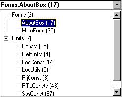

## Filtering

To simplify the translator's work Language Manager give you the possibility to limit the count of properties and constants displayed depending on your needs.

### Form/unit selection combo

This combo box allows to limit the set of displayed resources by one/all form(s) or by one/all unit(s) with constants. Choose it to cause appearance of the two-level tree that contains separately form names and unit names sorted alphabetically. 

    

Each form/unit name is accompanied by the number of items (in the brackets). The root nodes display the number of forms/units respectively. 

### Translated/untranslated

Language Manager allows you to view only translated values, only untranslated or both (default). Make appropriate language active and choose one of subitems of "Language | Show" menu item.

Current mode is indicated with triangle on the column header.

If neither of columns have such indication then both translated and untranslated values are displayed.

Limitation can be applied to single column in a time.

### Textual/non-textual

Language Manager allows you to view only textual properties, only non-textual properties (i.e. Width, Height etc.) or both (default). Make appropriate language active and choose one of subitems of "Language | Show" menu item.

This filter doesn't have effect on constants displaying.

### Untranslatable items

Untranslatable items are marked out with color or hidden depending on "Show untranslatable items" option. Select "Language | Show | Untranslatable Only" menu item to display untranslatable items only.

## Sorting

Language Manager allows you to view string values ordered ascending or descending. Values are ordered according to sorting rules of selected language.

### Original order

Properties are initially ordered by form name alphabetically. Inside of each form the order is the following:
- form properties are ordered alphabetically in the beginning;
- form components are ordered alphabetically. Properties of each component are ordered alphabetically too.

Constants are ordered by unit name alphabetically. Constants of each unit are ordered by constant name alphabetically.

### Sorting the language

Current sort order is indicated with triangle on the column header.

If neither of columns have such indication then values are displayed in the original order.

To sort values just click on column header or make appropriate language active and choose one of subitems of "Language | Sort" menu item.

You can also sort the fixed column (properties/constants names) by pressing on fixed column header. In this case properties can be sorted by full name (i.e. "Form1.Edit1.Text") of just by property name ("Text") depending on “Compare properties by full name” option value.

Sorting can be applied to single column in a time.

### Refreshing grid

When you change the values the grid does not reorder or filtered automatically. You need to refresh grid ("Edit | Refresh" menu item or F5 shortcut) to get the values ordered and filtered properly. 

