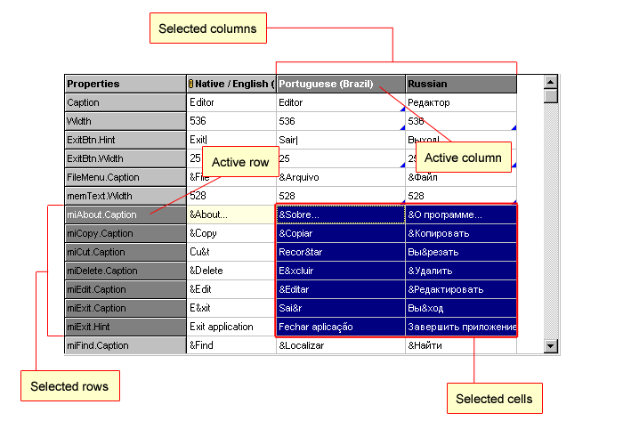

Starting from version 3.0 Language Manager allows to select and manipulate the range of cells. It is very useful if you need to perform the same action for numerous cells. 

    

### Selected cells

The selected cells are marked with Navy color. Current cell is outlined with dotted line in addition. If you press Enter or F2, the selection is cleared and the current cell is gone to the edit mode.

### Selected rows/columns

Language Manager performs some operations on entire rows or entire columns. The selected rows or columns are the scope of such actions.

### How to select a range of cells?

The range of cells can be selected using mouse (press left mouse button and hold it while dragging the cursor) or keyboard (hold Ctrl button and use arrows buttons) or both (select cell, hold Shift button and click on the other cell).

Click on any cell or use arrows keys to change the selection.

### Why do some menu items become unavailable?

Language Manager automatically disables the operations that are not allowed on the selected range of cells. For example, some actions are performed on the strings of the single language (i.e. "Revert to original", repository actions etc.). So, if more than one column is selected then such action will not be available.

Clipboard operations (`Cut`, `Copy`, `Paste`) do not work on multiple cells selected. 

