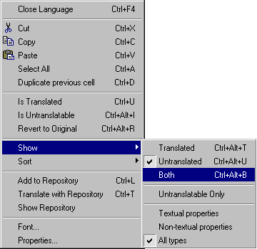

A lot of menu items are duplicated in the context menu that is appeared by the right mouse button click.

If multiple cells are selected, you may right click on any selected cell to evoke the context menu.

    

The most of frequently used commands are also available through the keyboard shortcuts. 
