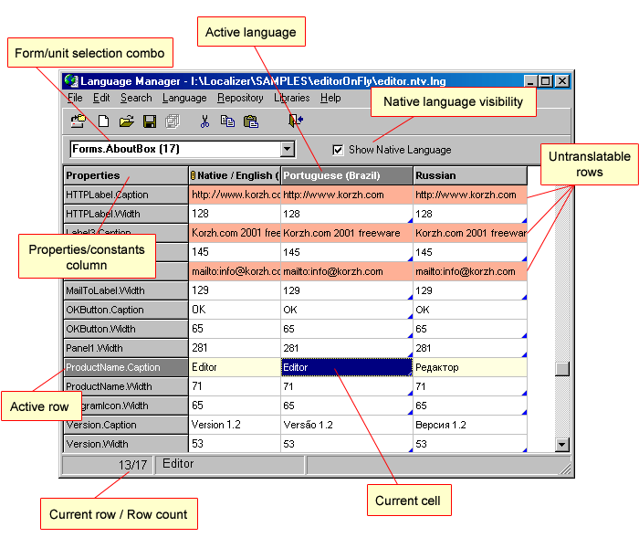

When the project is opened you see a grid that allows you to translate your language files. Each column but the fixed one corresponds to one language. You may change the order of columns by dragging and dropping them. Fixed (the most left) column contains properties / constants names. 

    
    
    

The grid filled with properties/constants values is the main field of action of a translator.
Each column of the grid represents the language file to be translated. Each row represents the property or the constant to be translated.
The special mark * put on the right side of the column caption means that the language has been modified (some cells have changed their values).

### Native language visibility check box

Unmark this check box if you want to hide the native language column. Mark it again to show the native language.

### Properties/Constants column

The most left (fixed) column displays the names of the properties or constants. The properties/constants names includes form/unit name if the form/unit selection combo is set to display all forms/units (i.e. Form1.Label1.Caption is displayed if Forms is selected). Otherwise, the forms/units names are omitted (i.e. Label1.Caption is displayed if Form1 is selected).

Click on the cell in this column to see a hint with full property/constant name.

### Active language

Active (current) language – the language of one of opened language files. Each open file corresponds to one column in the table. The active language column is marked out with darker header color. To make the column (language) active select one of it cells.
Operations concerning the language (somewhat file operations, font changing etc.) are performed under the active language.

### Read-only columns

The columns marked with readonlymark sign are read-only. It means that you will not be able to edit the cells in those columns.
The native language column is always marked as read-only to prevent the editing of native language.

### Translated/untranslated

The untranslatedmark sign in the cell right bottom corner indicates that its content was not translated yet (or its version is out-of-date). The state is changed to "translated" when you edit the cell.
If the native value was updated by the Language Wizard, the others state is changed to "untranslated". In this case the values that have never been translated are changed to the new native value.
The translator can also set the state manually.

### Untranslatable items

The developer can mark some properties or constants as untranslatable. Such rows are marked out with color and do not allow to edit their cells. The program can automatically hide the untranslatable rows if the appropriate option is set.

The Language Manager installed separately (not in the Localizer package) does not allow to change the translatable/untranslatable status of the row.

The untranslatable properties and constants are not changed during language switching.

### Verified cells

If the cell value is checked and is not to be changed in the future, the cell can be marked as "verified". Such cells are marked out with color and can not be edited (read only).

The cells marked as untranslated can not be marked as verified. When the cell state is changed to "untranslated" (due to native language updating), the "verified" mark is removed.

### Repository availability

The reposavailable sign in the cell right bottom corner indicates that this cell has proper translation in the Repository and can be translated via it. If the cell can be translated only using "smart repository" feature, the color of triangle is yellow - smartreposavailable. 
